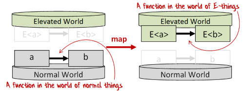

# Ziel 

## Programm

-   Hausaufgaben
-   Algorithmen
    -   Operationen auf einer Liste
    -   Wiederholung (Pattern Matching, Rekursion)
-   ROP (Railway Oriented Programming)
    -   Umgang mit fehlende Daten (Option)
    -   Umgang mit Fehlern (Result)

# Hausaufgaben 

## Two-Fer

    let twoFer (input: string option): string = 
        input 
        |> Option.defaultValue "you"
        |> sprintf "One for %s, one for me."
    
    let test1 = [twoFer None; twoFer (Some "Alice"); twoFer (Some "Bob")]

    val twoFer: input: string option -> string
    val test1: string list =
      ["One for you, one for me."; "One for Alice, one for me.";
       "One for Bob, one for me."]

## Leap

    let divisible_by n d = n % d = 0
    let leapYear year =
        let year_divisible_by = divisible_by year
        year_divisible_by 4
        && not(year_divisible_by 100) 
        || year_divisible_by 400
    
    let test1 = [leapYear 1900; leapYear 1996]
    let test2 = [leapYear 2000; leapYear 2019; leapYear 2020]

    val divisible_by: n: int -> d: int -> bool
    val leapYear: year: int -> bool
    val test1: bool list = [false; true]
    val test2: bool list = [true; false; true]

## Isogram

    let isIsogram (str: string) =
        let letters =
            str.ToLowerInvariant()
            |> Seq.filter System.Char.IsLetter
            |> Seq.toList
        letters
        |> Seq.distinct
        |> Seq.length
        |> (=) letters.Length
    let test1 = [isIsogram ""; isIsogram "isogram"]
    let test2 = [isIsogram "eleven"; isIsogram "subdermatoglyphic"]

    val isIsogram: str: string -> bool
    val test1: bool list = [true; true]
    val test2: bool list = [false; true]

## Sum Of Multiples

    let multiplesOf max n =
        if n = 0 then [0] else [n .. n .. (max - 1)]
    let sum (numbers: int list) (upperBound: int): int =
        numbers
        |> List.collect (multiplesOf upperBound)
        |> List.distinct
        |> List.sum
    #time "on"
    let test = [sum [3; 5] 1000; sum [2; 3; 5; 7; 11] 10000]
    #time "off"

    val multiplesOf: max: int -> n: int -> int list
    val sum: numbers: int list -> upperBound: int -> int
    
    
    --> Timing now on
    
    Real: 00:00:00.001, CPU: 00:00:00.001, GC gen0: 0, gen1: 0, gen2: 0
    val test: int list = [233168; 39614537]
    
    
    --> Timing now off

# Algorithmen (List Ops) 

## length

    let rec length' list =
        match list with
        | [] -> 0
        | _::xs -> 1 + length' xs
    let length list =
        let rec _length list acc =
            match list with
            | [] -> acc
            | _::xs -> _length xs (acc + 1)
        _length list 0
    
    let test1 = [length' []; length' [1; 2; 3; 4]]
    let test2 = [length []; length [1; 2; 3; 4]]

    val length': list: 'a list -> int
    val length: list: 'a list -> int
    val test1: int list = [0; 4]
    val test2: int list = [0; 4]

## reverse

    let reverse list =
        let rec _reverse list acc =
            match list with
            | [] -> acc
            | x::xs -> _reverse xs (x::acc)
        _reverse list []
    
    let test1 = reverse [1; 3; 5; 7]
    let test2 = reverse [[1; 2]; [3]; []; [4..8]]

    val reverse: list: 'a list -> 'a list
    val test1: int list = [7; 5; 3; 1]
    val test2: int list list = [[4; 5; 6; 7; 8]; []; [3]; [1; 2]]

## map

    let map f list = 
        let rec _map f list acc =
            match list with
            | [] -> acc |> reverse
            | x::xs -> _map f xs ((f x)::acc)
        _map f list []   
    
    let test = map (fun x -> x + 1) [1; 3; 5; 7]

    val map: f: ('a -> 'b) -> list: 'a list -> 'b list
    val test: int list = [2; 4; 6; 8]

## filter (Übung)

    // filter : f:('a -> bool) -> list:'a list -> 'a list
    let filter f list =
        ...
        match list with
        | [] -> ...
        | x::xs -> ...
    
    let test = filter (fun x -> x % 2 = 1) [1..1000]

    val filter : f:('a -> bool) -> list:'a list -> 'a list
    val test : int list =
      [1; 3; 5; 7; 9; 11; 13; 15; 17; 19; 21; 23; 25; 27; 29; 31; 33; 35; 37; 39;
       41; 43; 45; 47; 49; 51; 53; 55; 57; 59; 61; 63; 65; 67; 69; 71; 73; 75; 77;
       79; 81; 83; 85; 87; 89; 91; 93; 95; 97; 99; 101; 103; 105; 107; 109; 111;
       113; 115; 117; 119; 121; 123; 125; 127; 129; 131; 133; 135; 137; 139; 141;
       143; 145; 147; 149; 151; 153; 155; 157; 159; 161; 163; 165; 167; 169; 171;
       173; 175; 177; 179; 181; 183; 185; 187; 189; 191; 193; 195; 197; 199; ...]

## filter (Lösung 1)

    let rec filter f list = 
        match list with
        | [] -> []
        | x::xs -> match f x with
                   | true -> x :: filter f xs
                   | false -> filter f xs
    let test = filter (fun x -> x % 2 = 1) [1..10_000]

    val filter: f: ('a -> bool) -> list: 'a list -> 'a list
    val test: int list =
      [1; 3; 5; 7; 9; 11; 13; 15; 17; 19; 21; 23; 25; 27; 29; 31; 33; 35; 37; 39;
       41; 43; 45; 47; 49; 51; 53; 55; 57; 59; 61; 63; 65; 67; 69; 71; 73; 75; 77;
       79; 81; 83; 85; 87; 89; 91; 93; 95; 97; 99; 101; 103; 105; 107; 109; 111;
       113; 115; 117; 119; 121; 123; 125; 127; 129; 131; 133; 135; 137; 139; 141;
       143; 145; 147; 149; 151; 153; 155; 157; 159; 161; 163; 165; 167; 169; 171;
       173; 175; 177; 179; 181; 183; 185; 187; 189; 191; 193; 195; 197; 199; ...]

## filter (Lösung 2)

    let filter f list = 
        let rec _filter f list acc = 
            match list with
            | [] -> acc |> reverse
            | x::xs ->  match f x with
                        | true -> _filter f xs (x::acc)
                        | false -> _filter f xs acc
        _filter f list []
    let test = filter (fun x -> x % 2 = 1) [1..10_000]
    test

## Große Zahlen (Übung)

-   Berechne $5^{4^{3^2}}$
-   Wie lang ist die Zahl?
-   Gib die ersten und letzten 20 Ziffern an!

## Große Zahlen (Lösung)

    #time "on"
    let answer = 5I **(int (4I ** (int (3I ** 2))));;
    let sans = answer.ToString()
    let l = sans.Length
    let prefix = sans.Substring(0,20)
    let suffix = sans.Substring(l-20)
    #time "off"
    printfn "Length = %d, digits %s ... %s" l prefix suffix

    let sans = answer.ToString()
    let l = sans.Length
    let prefix = sans.Substring(0,20)
    let suffix = sans.Substring(l-20)
    #time "off"
    printfn "Length = %d, digits %s ... %s" l prefix suffix;;
    Real: 00:00:00.510, CPU: 00:00:00.806, GC gen0: 0, gen1: 0, gen2: 0
    val sans: string =
      "6206069878660874470748320557284679309194219265199117173177383"+[183170 chars]
    val l: int = 183231
    val prefix: string = "62060698786608744707"
    val suffix: string = "92256259918212890625"
    
    
    --> Timing now off
    
    Length = 183231, digits 62060698786608744707 ... 92256259918212890625
    val it: unit = ()

\scriptsize

    let sans = answer.ToString()
    let l = sans.Length
    let prefix = sans.Substring(0,20)
    let suffix = sans.Substring(l-20)
    #time "off"
    printfn "Length = %d, digits %s ... %s" l prefix suffix;;
    Real: 00:00:00.502, CPU: 00:00:00.505, GC gen0: 0, gen1: 0, gen2: 0
    val sans: string =
      "62060698786608744707483205572846793091942O19265199117173177383"+[183170 chars]
    val l: int = 183231
    val prefix: string = "62060698786608744707"
    val suffix: string = "92256259918212890625"
    
    
    --> Timing now off
    
    Length = 183231, digits 62060698786608744707 ... 92256259918212890625
    val it: unit = ()

## foldl

    let rec foldl folder state list = 
        match list with
        | [] -> state
        | x::xs -> foldl folder (folder state x) xs
    
    let test1 = foldl (+) 0 [1..1_000]
    let test2 = foldl (*) 1I [1I..42I]

    val foldl: folder: ('a -> 'b -> 'a) -> state: 'a -> list: 'b list -> 'a
    val test1: int = 500500
    val test2: Numerics.BigInteger =
      1405006117752879898543142606244511569936384000000000

## foldr

    let flip f b a = f a b 
    let rec foldr folder state list = 
        foldl (flip folder) state (reverse list)
    
    let test = foldr (+) 5 [1; 2; 3; 4]

    val flip: f: ('a -> 'b -> 'c) -> b: 'b -> a: 'a -> 'c
    val foldr: folder: ('a -> 'b -> 'b) -> state: 'b -> list: 'a list -> 'b
    val test: int = 15

## append

    let append xs ys = foldr (fun x acc -> x :: acc) ys xs
    
    let test = append [1..5] [6..10] 

    let append xs ys = foldr (fun x acc -> x :: acc) ys xs
    
    let test = append [1..5] [6..10];;
    val append: xs: 'a list -> ys: 'a list -> 'a list
    val test: int list = [1; 2; 3; 4; 5; 6; 7; 8; 9; 10]

## concat (1)

    let concat xs = foldr append [] xs
    let rec concat' xs = 
        match xs with
        | [] -> []
        | []::ys -> concat' ys
        | (x::xs)::ys -> x:: (concat' (xs::ys))
    let concat'' xs =
        let rec _concat xs acc = 
            match xs with
            | [] -> acc |> reverse
            | []::ys -> _concat ys acc
            | (x::xs)::ys -> _concat (xs::ys) (x::acc)
        _concat xs []

    val concat: xs: 'a list list -> 'a list
    val concat': xs: 'a list list -> 'a list
    val concat'': xs: 'a list list -> 'a list

## concat (2)

    let test1 = concat [[1; 2]; [3]; []; [4; 5; 6]]
    let test2 = concat' [[1; 2]; [3]; []; [4; 5; 6]]
    let test3 = concat'' [[1; 2]; [3]; []; [4; 5; 6]]
    
    let test1b = concat [[[1]; [2]]; [[3]]; [[]]; [[4; 5; 6]]]
    let test2b = concat' [[[1]; [2]]; [[3]]; [[]]; [[4; 5; 6]]] 
    let test3b = concat'' [[[1]; [2]]; [[3]]; [[]]; [[4; 5; 6]]] 

    let test1 = concat [[1; 2]; [3]; []; [4; 5; 6]]
    let test2 = concat' [[1; 2]; [3]; []; [4; 5; 6]]
    let test3 = concat'' [[1; 2]; [3]; []; [4; 5; 6]]
    
    let test1b = concat [[[1]; [2]]; [[3]]; [[]]; [[4; 5; 6]]]
    let test2b = concat' [[[1]; [2]]; [[3]]; [[]]; [[4; 5; 6]]] 
    let test3b = concat'' [[[1]; [2]]; [[3]]; [[]]; [[4; 5; 6]]];;
    val test1: int list = [1; 2; 3; 4; 5; 6]
    val test2: int list = [1; 2; 3; 4; 5; 6]
    val test3: int list = [1; 2; 3; 4; 5; 6]
    val test1b: int list list = [[1]; [2]; [3]; []; [4; 5; 6]]
    val test2b: int list list = [[1]; [2]; [3]; []; [4; 5; 6]]
    val test3b: int list list = [[1]; [2]; [3]; []; [4; 5; 6]]

## Pause

1.  

    There is no programming language, no matter how structured, 
    that will prevent programmers from making bad programs.
    
    \null\hfill&#x2013;Larry Flon (1975)

# ROP 

## ROP

$\leadsto$ [Railway Oriented Programming](./2 Railway Oriented Programming.pdf)

\null\hfill&#x2013;Scott Wlashin: [F# for Fun and Profit](https://fsharpforfunandprofit.com/rop/)

## Option

    type BillingDetails = { 
        name : string
        billing :  string
        delivery : string option }
    let order1 = {
        name = "Adam Smith"
        billing = "112 Fibonacci Street\n35813" 
        delivery = None }
    let order2 = {
        name = "John Doe"
        billing = "314 Pi Avenue\n35999"
        delivery = Some "16 Planck Parkway\n62291" }

## Option

    let addressForPackage (details : BillingDetails) = 
        let address =
            match details.delivery with 
            | Some s -> s
            | None -> details.billing
        sprintf "%s\n%s" details.name address
    printfn "%s" (addressForPackage order1)
    printfn "%s" (addressForPackage order2)

    
      let addressForPackage (details : BillingDetails) = 
      ---------------------------------^^^^^^^^^^^^^^
    
    /Users/kirchnerg/Desktop/courses/course.2024.hwr.fun/slides/stdin(297,34): error FS0039: The type 'BillingDetails' is not defined.

## Option `bind` and `map`

    open System
    let tryLastLine (address : string) = 
        let parts = address.Split([|'\n'|], StringSplitOptions.RemoveEmptyEntries)
        parts |> Array.tryLast
    let tryPostalCode (codeString : string) = 
        match Int32.TryParse(codeString) with 
        | true, i -> i |> Some
        | false, _ -> None
    let postalCodeHub (code : int) = 
        if code = 62291 then "Hub 1" else "Hub 2"
    let tryHub (details : BillingDetails) = 
        details.delivery
        |> Option.bind tryLastLine 
        |> Option.bind tryPostalCode 
        |> Option.map postalCodeHub

## Option

    let test1 = order1 |> tryHub
    let test2 = order2 |> tryHub

    
      let test1 = order1 |> tryHub
      ------------^^^^^^
    
    /Users/kirchnerg/Desktop/courses/course.2024.hwr.fun/slides/stdin(306,13): error FS0039: The value or constructor 'order1' is not defined.

## Result (Imperativ)

    open System
    let checkString (s : string) =
      if isNull(s) then
        raise <| ArgumentNullException("Must not be null")
      elif String.IsNullOrEmpty(s) then
        raise <| ArgumentException("Must not be empty")
      elif String.IsNullOrWhiteSpace(s) then
        raise <| ArgumentException("Must not be white space")
      else
        s
    //checkString null
    //checkString ""
    checkString " "

    System.ArgumentException: Must not be white space
       at FSI_0078.checkString(String s) in /Users/kirchnerg/Desktop/courses/course.2024.hwr.fun/slides/stdin:line 316
       at <StartupCode$FSI_0078>.$FSI_0078.main@() in /Users/kirchnerg/Desktop/courses/course.2024.hwr.fun/slides/stdin:line 321
       at System.RuntimeMethodHandle.InvokeMethod(Object target, Void** arguments, Signature sig, Boolean isConstructor)
       at System.Reflection.MethodBaseInvoker.InvokeWithNoArgs(Object obj, BindingFlags invokeAttr)
    Stopped due to error

## Result (Result<'Success,'Failure>)

    open System
    let notEmpty (s : string) =
        if isNull(s) then Error "Must not be null"
        elif String.IsNullOrEmpty(s) then Error "Must not be empty"
        elif String.IsNullOrWhiteSpace(s) then Error "Must not be white space"
        else Ok s
    let t1 = notEmpty null;;
    let t2 = notEmpty "";;
    let t3 = notEmpty " ";;
    t1, t2, t3

    t1, t2, t3;;
    val it: Result<string,string> * Result<string,string> * Result<string,string>
    = (Error "Must not be null", Error "Must not be empty",
       Error "Must not be white space")

## Result (Error-Types DU)

    open System
    type ValidationError =
               | MustNotBeNull
               | MustNotBeEmpty
               | MustNotBeWhiteSpace
    let notEmpty (s : string) =
        if isNull(s) then Error MustNotBeNull
        elif String.IsNullOrEmpty(s) then Error MustNotBeEmpty
        elif String.IsNullOrWhiteSpace(s) then Error MustNotBeWhiteSpace
        else Ok s
    let t1 = notEmpty null;;
    let t2 = notEmpty "";;
    let t3 = notEmpty " ";;
    notEmpty, t1, t2, t3

    notEmpty, t1, t2, t3;;
    val it:
      (string -> Result<string,ValidationError>) * Result<string,ValidationError> *
      Result<string,ValidationError> * Result<string,ValidationError> =
      (<fun:it@347-7>, Error MustNotBeNull, Error MustNotBeEmpty,
       Error MustNotBeWhiteSpace)

## Map

-   E.map (`<$>`): `(a->b) -> E<a> -> E<b>`
    
    

## Bind

-   E.bind (`>>=`): `(a->E<b>) -> E<a> -> E<b>`
    
    

## Pause

1.  

    Applications programming is a race between software engineers, 
    who strive to produce idiot-proof programs, 
    and the universe which strives to produce bigger idiots. 
    So far the Universe is winning.
    
    \null\hfill&#x2013; Rick Cook (1989)

# Ende 

## Zusammenfassung

-   funktionale Operationen auf Listen (Tail-Rekursion)
-   funktionaler Umgang mit fehlenden Daten (Option)
-   funktionaler Umgang mit Fehlern (Result)

## Links

-   [fsharp.org](https://fsharp.org/)
-   [docs.microsoft.com/../dotnet/fsharp](https://docs.microsoft.com/de-de/dotnet/fsharp/)
-   [F# weekly](https://sergeytihon.com/)
-   [fsharpforfunandprofit.com](https://fsharpforfunandprofit.com/)
-   [github.com/../awesome-fsharp](https://github.com/fsprojects/awesome-fsharp)

## Hausaufgabe

-   exercism.io (E-Mail bis 02.04)
    -   [ ] Queen Attack
    -   [ ] Raindrops
    -   [ ] Gigasecond
-   exercism.io (E-Mail bis 15.04)
    -   [ ] Bank Account
    -   [ ] Accumulate
    -   [ ] Space Age
-   exercism.io (E-Mail bis 29.04)
    -   [ ] Poker (Programmieraufgabe)

